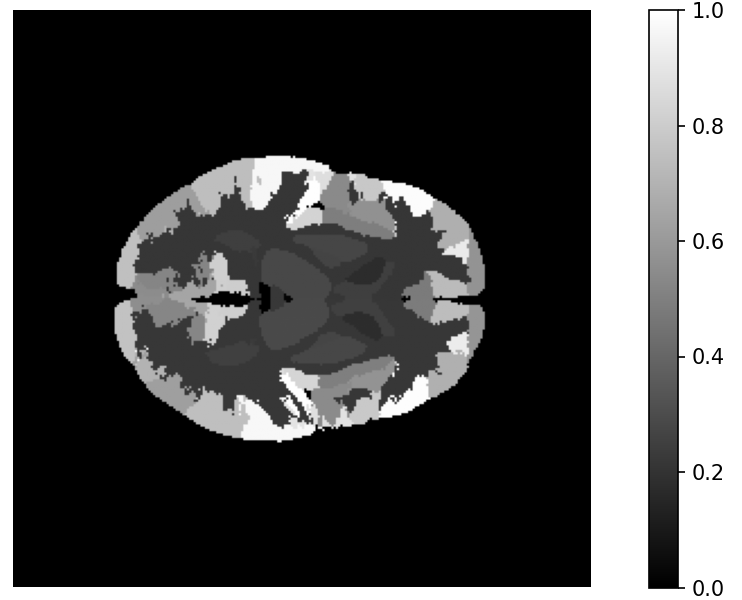
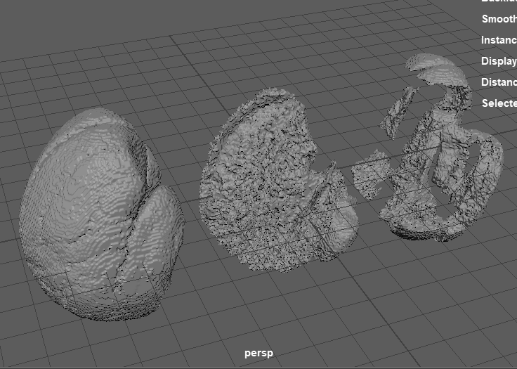
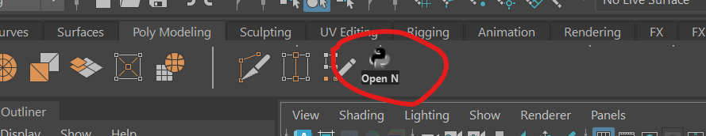
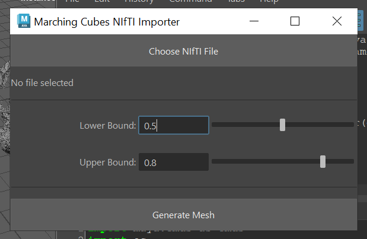

> *Développement d'une extension Maya pour la reconstruction de scanners médicaux*
# Marching Cubes

### Avant propos
Ce projet explore l'utilisation des Marching Cubes pour un usage d'imagerie médicale. J'ai découvert les Marching Cubes par hasard dans le domaine de la chimie, où étaient représentés des orbitales atomiques autour d'une molécule.

En fait, les fonctions quantiques ne permettent que de calculer la probabilté de présence des électrons à des points données de l'espace.
Pour pouvoir représenter ces lobes, il faut fixer une "probabilité frontière", et construire une surface là où la fonction de probabilité donne des résultats inférieurs.

Cette opération -pas si triviale- est exécutée par la technique des "Marching Cubes" : un cube unité va "marcher" tout le long du champ de valeurs et progressivement construire la surface triangle par triangle.

Le présent projet explore cette curiosité algorithmique ! Plus d'infos sur les Marching Cubes dans [cette vidéo](https://youtu.be/M3iI2l0ltbE).

Puis, une fois l'algorithme apprivoisé pour la création d'environnements 3D, j'ai finalement expérimenté ma propre approche en proposant un outil original destiné à la reconstruction de scanners médicaux.

## Principe

Ce script permet d'ouvrir dans Maya des fichiers de scanners médicaux (format standard NIfTI, soit .nii), et d'en modéliser les volumes désirés.

Ces fichiers sont des gros nuages de point. A chaque point est associé une valeur : ce sont les densités mesurées par le scanner en chaque point de l'espace.

La manière standard de les observer est d'en afficher une coupe, en échelonnant les valeurs sur une *heatmap*.


Le script propose d'isoler et reconstruire en 3D ces structure. On commence donc par choisir la plage de densité qui nous intéresse (par exemple pour un scanner cranien, les os, la matière grise et la matière blanche ont des densités distinctes), et le script va en construire les contours sous la forme d'un mesh.

*(ci-dessus) résultat du script pour 3 densités différentes, soit 3 matières différentes*

## Installation
Télécharger et dézipper le dossier. Installer les pour Maya les dépendances python `numpy` et `nibabel` (pour l'ouverture des fichiers NIfTI). Entrer dans l'invité de commande :
- Sur windows :
```
"C:\Program Files\Autodesk\Maya2025\bin\mayapy.exe" -m pip install numpy nibabel
```
- Sur Mac (non testé) :
```
/Applications/Autodesk/maya2025/Maya.app/Contents/bin/mayapy -m pip install numpy nibabel
```


Ouvir Maya. Importer `main_script/marching_cubes.py` dans l'éditeur de script. Lancer le script.

*Optionnel* : Dans l'éditeur de script, le bouton `Save script to Shelf...` permet de créer un bouton dans Maya pour lancer le script en 1 clic.


## Utilisation
Le lancement du script affiche une fenêtre :


Le premier bouton permet de sélectionner le scanner qu'on veut ouvrir. J'en ai téléchargé quelques exemples dans le dossier `scan_examples`, tirés de [ce site](https://johnmuschelli.com/high_res_ct_template/template/).

Puis, grâce aux sliders, on sélectionne la plage de densité qui nous intéresse, et dont on veut tracer les contours : par défaut, de 0.5 à 0.8.

Enfin, on lance la génération avec le bouton "Generate Mesh".

## Exécution

Le programme va d'abord convertir le fichier `.nii` en un volume `numpy` compréhensible par python grâce à nibabel.

*1ère barre de progression*

Le cube unité se déplace ensuite dans le nuage de point, en traçant des triangles lorsque certains sommets se trouvent à une "frontière".

La configuration de ces triangles est donnée par la table `GEOMETRY_LOOKUP`, tirée de [ce site](http://www.paulbourke.net/geometry/polygonise/).

*2ème barre de progression*

On supprime ensuite les points en doublon, et on sauvegarde les points et faces dans un `.obj` temporaire que Maya va pouvoir importer comme un unique mesh.

Enfin, on nettoie rapidement le mesh : recalcul des normales et *smooth*.

*Message de confirmation*

Un exemple de 3 résultats de mesh pour 3 plages de densités différentes (cf. leur nom) est disponible dans la scène maya `example_scene/outputs.mb`.

## Limites

Le cube unité doit "marcher" tout le long du nuage de point, ce qui le rend peut performant quand les scan dépassent une certaine résolution.

Quand on double la résolution, on passe de `n` à `n²` points, le temps d'exécution augmente donc quadratiquement. 

On peut l'observer avec les lourds fichiers de [ce site](https://johnmuschelli.com/high_res_ct_template/template/) échantillonnés à 0.5mm², qui mettent ~20min à s'ouvrir (quand Maya plante pas), alors que le fichier `template_with_skull_2mm`, échantillonné à 2mm², met ~20sec.

Pour résoudre ce problème, je pense qu'on pourrait tirer parti que chaque cube peut être traité parallèlement, en s'intéressant à un traitement GPU grâce à CUDA, mais je doute que ce soit facilement compatible avec Maya.

## Bonus

Au lieu de choisir la plage de densité à l'aveugle (lower et upper bound), j'ai fait un petit script indépendant `utils/previz_data.py` qui permet d'afficher rapidement une coupe du scan. En passant la souris sur les zones qui nous intéressent, on récupère leur valeur en haut à droite.


